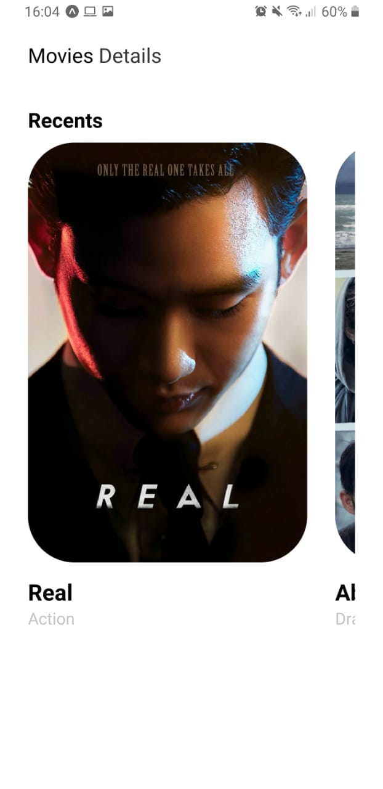

<h1 align="center"> 
    Movies Details
</h1>

# Índice

- [Sobre](#sobre)
- [Tecnologias utilizadas](#tecnologias-utilizadas)
- [Como usar](#como-usar)
- [Como contribuir](#como-contribuir)

## :bookmark: Sobre 

- <b>App de Filmes</b> desenvolvido em uma aula de Desenvolvimento Mobile na faculdade. O App possuí uma <b>listagem</b> de filmes fornecidos de uma API e também, é possível obter <b>detalhes</b> de cada filme.

- Após a implementação de alguns conceitos básicos eu resolvi seguir a mesma idéia do App apresentado pelo professor em aula, porém com um <b>layout próprio</b>.

## :rocket: Tecnologias Utilizadas

- [React Native](https://reactnative.dev/)
- [Expo](https://expo.io/)
- [React Navigation v5](https://reactnavigation.org/)
- [Axios](https://github.com/axios/axios)

## :heavy_check_mark: Resultado

<h4 align="center">
    
    
</h4>

## :fire: Como usar

- Clone esse repositório: `git clone https://github.com/vitorserrano/movies-details.git`
- Instale as dependências: `npm install` 
- Start a aplicação: `npm start`

## :recycle: Como contribuir

- Faça um Fork desse repositório,
- Crie uma branch com a sua feature: `git checkout -b my-feature`
- Commit suas mudanças: `git commit -m 'feat: My new feature'`
- Push a sua branch: `git push origin my-feature`

## :memo: License

Esse projeto está sob a licença MIT. Veja o arquivo [LICENSE](LICENSE) para mais detalhes.

